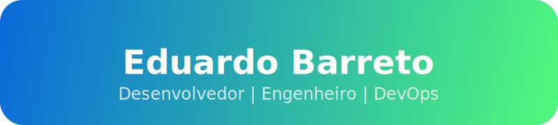

# 
🚀 **Eduardo Barreto**

  
  

  
<strong>Olá!</strong> 👋 Sou um desenvolvedor apaixonado por tecnologia, automação e soluções escaláveis.

 

## 💫 Sobre Mim

<table>
<tr>
<td width="50%">

### O Que Eu Faço
- 🌩️ **Especialista em Cloud & DevOps**
  - Arquitetura de infraestruturas escaláveis
  - Experiência com AWS, Azure e Kubernetes
- 🤖 **Entusiasta de Automação**
  - Pipelines CI/CD
  - Infraestrutura como Código (IaC)
- 📝 **Criador de Conteúdo**
  - Tutoriais técnicos
  - Projetos open-source

</td>
<td width="50%">

### Links Rápidos

</td>
</tr>
</table>

  

## 🌐 Aprendizado em DevOps

> [!IMPORTANTE]
>
> Compartilhando conhecimento em DevOps e Cloud — Um recurso de cada vez

<table>
<tr>
<td width="50%">

### 📚 Recursos de Aprendizado
- [💻 Projetos Reais](https://github.com/edubarret0) - Projetos práticos de DevOps
- [📚 Documentação](https://github.com/edubarret0) - Materiais técnicos e guias
- [📦 Repositórios](https://github.com/edubarret0) - Scripts e código de infraestrutura

</td>
<td width="50%">

### 🎯 Nossa Missão
Acreditamos que o conhecimento em DevOps deve ser acessível a todos. Nossos valores:
- 🔓 Quebrar barreiras
- 🛠️ Aprender construindo
- 🤝 Crescimento comunitário
- 📈 Melhoria contínua
- 🌟 Experiência prática

</td>
</tr>
</table>

## 🤝 Conecte-se Comigo

  
  
  

---

  

